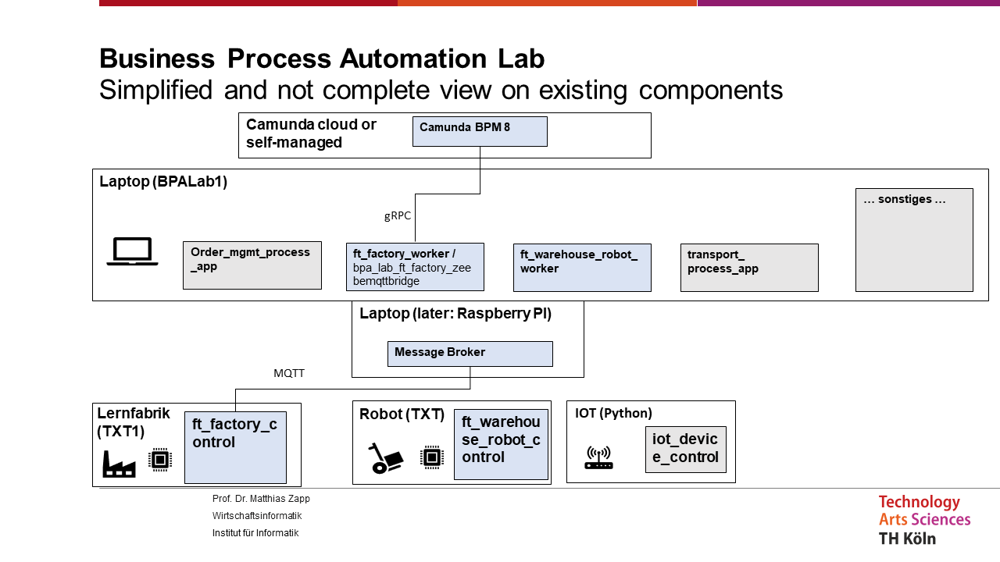

# bpa_lab_docs 
## about this repository 
This repository contains documentation about the BPA Lab as a demonstration factory, which is supposed to simulate a bicycle ordering, manufacturing and shipment process.

Please refer to the bpa_lab_student_docs repository (wiki) for documentation on using modules within the BPA Lab (e.g. warehouse robot) to design and implement other business processes. 

Please refer to bpa_lab_papyrus_uml for raw data of architecture diagrams created in Papyrus.

## about repositories in BpaLabTHCologne organization
The technical components of the new (2023) BPA Lab implementation are distributed across several repositories. Besides the repositories for documentation (this one, bpa_lab_student_docs and bpa_lab_papyrus_uml).

The organization contains the following repositories: 

### Controller level: 

bpa_lab_txt_warehouse_control: Control component for the Fischertechnik warehouse robot

bpa_lab_ft_factory_control: Control component for the Fischertechnik Learning Factory 

### Communication between Controler and Job worker level:

bpa_lab_broker: Info on MQQT setup; required for communication of controller and job worker 

### Job Worker level:

bpa_lab_warehouse_robot: Zeebe (Camunda 8) job worker communicated via MQQT with bpa_lab_txt_warehouse_control and via gRPC with Camunda 8 (Cloud). Implementation includes simpliefied business process, databases etc.

bpa_lab_ft_factory_zeebemqttbridge: Zeebe (Camunda 8) job worker communicated via MQQT with bpa_lab_ft_factory_control

### Process level: 

Remark: There is currently no implementation of end-to-end business process as e.g. implemented in BPALab_GP22_23 based on depreciated architecture. 

## about depreciated repositories in BpaLabTHCologne organization

This GitHub organisation contains a number of (in principle) depreciated repositories containing the results of student projects between 2021 and 2023. Some of these do not follow the new (2023) architecture of the BPA Lab solution. However, all these projects contain valuable parts that are (partly) not integrated in the new solution

BPALab_22_Prototype_IOT: Very initial prototype for integrating a Camunda with an IOT device and a Fischertechnik warehouse robot. Based on Camunda 7, no docker. All parts are used in other repositories.

BPALab_GP22_23: Result of the Camunda (and RPA) part of the Guided Project WS 22/23. Contains valuable parts (overall process design for bicycle manufacturing, single page application for order entry connected to Camunda, RPA demonstrator for shipping). It introduces a docker setup. Solution based on Camunda 7 and without MQQT. Results should be considered as a design document or in some cases as building blocks for a new solution.

BPALab_22_Prototype_IOT: Results of Guided Project WS 22/23 for IOT solution with integration to Camunda. It is not integrated with Camunda / RPA deliverable and was (partly) used in the master thesis IoT-aware-BP. It contains the most sophisticated IOT device logic.

IoT-aware-BP: Master thesis at BPA Lab, focusing on how to integrate process and IoT data in terms of architecture, process modelling, etc. Implementation based on Camunda 8! Concepts will be used for future design. Integration of warehouse robots in business process (manufacturing and shipping) to be considered. IOT device setup must be combined with results from BPALab_22_Prototype_IOT (which uses more sophisticated setup).  

## deployment diagram

