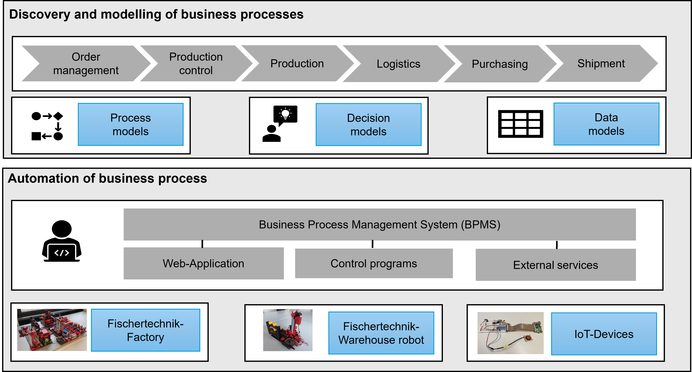
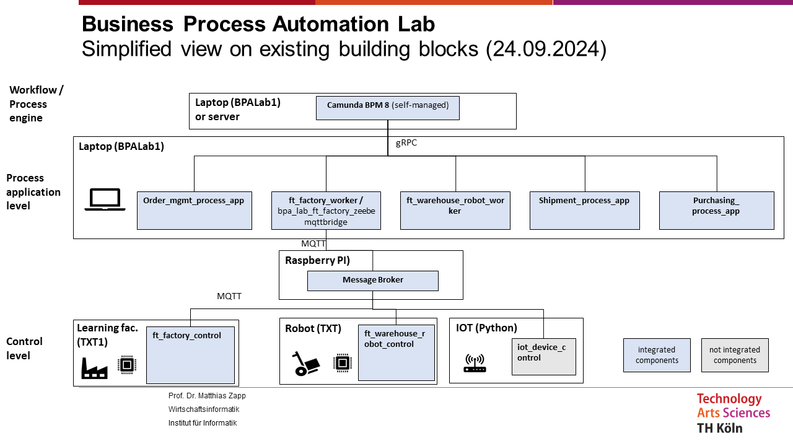
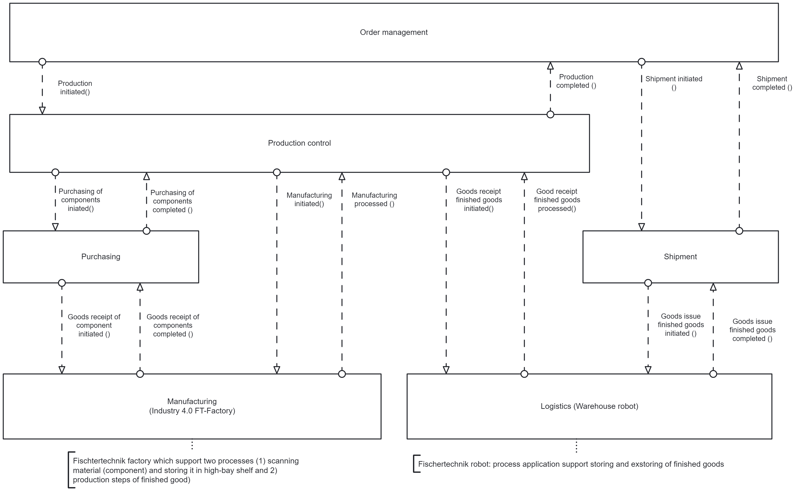
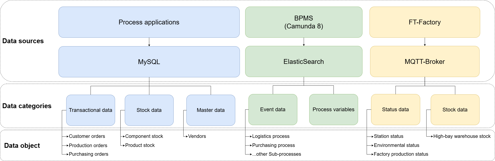
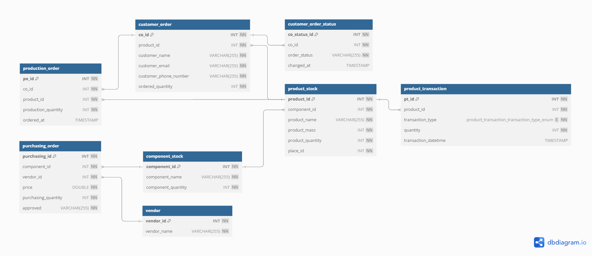
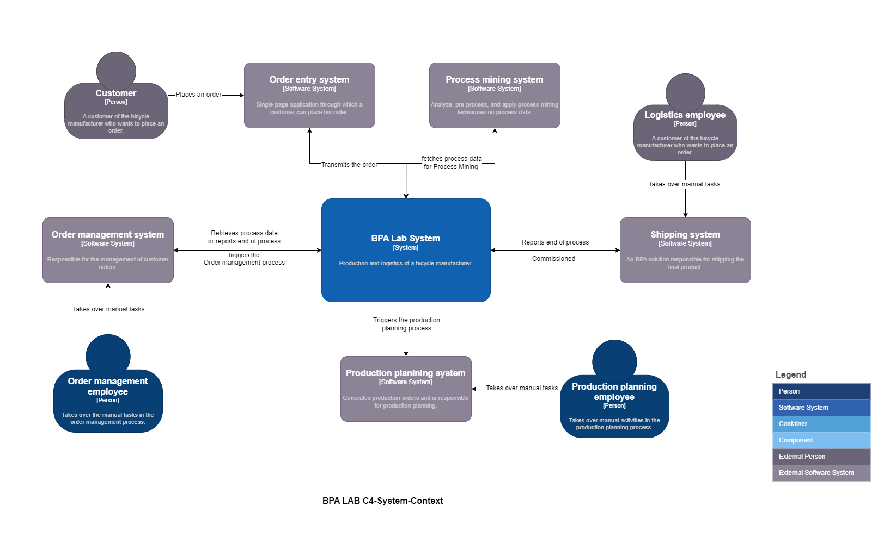
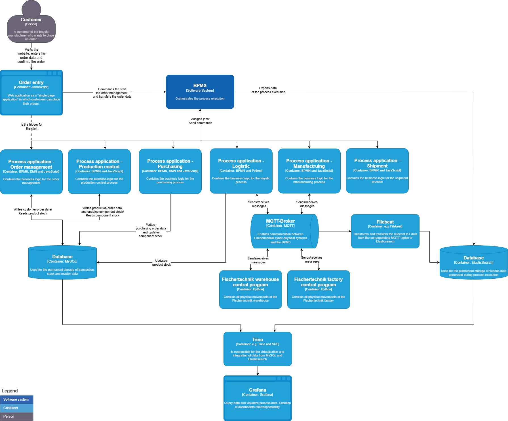

# bpa_lab_docs 
## About the BPA lab
The Business Process Automation Lab (BPA Lab) at the TH Cologne is a small-sized and modular model factory focused on business process automation and analytics. 

The BPA Lab has two main goals: 

1) Demonstration: Demonstrate concepts and technologies for business process automation and analytics. To this end, various software components such as Business Process Management Systems (BPMS) and Robotic Process Automation (RPA) are combined with hardware components like a Fischertechnik I4.0 factory, a Fischertechnik warehouse robot and IoT devices to simulate the production and logistics processes of a bicycle manufacturing company. In addition, technologies such as process mining will be used to demonstrate how business processes can be analysed and improved through a data-driven approach. 

2) Teaching: Individual building blocks of the BPA Lab (like the Fischertechnik warehouse robot) will be used in student projects (Bachelor) as building blocks for self-defined process implementations to teach the aspect of process-oriented application integration in a tangible way. 

## About this repository 
This repository contains documentation about the implementation of the BPA Lab as a Demonstration Factory. The demonstration scenario is an end-to-end bicycle ordering, manufacturing and shipment process.
This process has been implemented with Camunda 8 (BPMS) as the central BPMS and multiple other software components. This implementation is available at ([bpa_lab_demonstration_factory](https://github.com/BpaLabTHCologne/bpa_lab_demonstration_factory))

Please refer to the bpa_lab_student_docs repository (wiki) for documentation on how to use individual components of the BPA Lab (e.g. warehouse robot) inside self-developed process implementation projects ([bpa_lab_student_docs](https://github.com/BpaLabTHCologne/bpa_lab_student_docs/wiki)).

The following sections provide:
- a high level overview of the solution
- a description of the business scenario (business processes) implemented in the BPA Lab
- a description of the software architecture and design decisions

## About the solution 
The architecture and implementation are  under continous development. The architecture covers the following three levels (see simplified overview):
- Controller: control of hardware components (which are: FT I4.0 factory, FT robots, IOT devices) mostly developed in Python
- Process applications (job workers) communicating via gRPC to Camunda 8 and via MQTT to controllers mostly developed in Java
- (BPMS) Workflow engine: Camunda 8 (self-managed) platform executing various processes and decision models (BPMN and DMN) of the process applications

A modular design following a domain driven design approach is envisaged to allow independent and parallel work of student (developers) in the factory. It should also allow to use components in student projects to develop own process applications. Therefore, the primary criteria for splitting job workers and process models is the business domain (order management, manufacturing, shipping, purchasing, logistics...). 

### Simplified overview 

### Implementation of the demonstration factory

The latest version of the BPALab as a Demonstration Factory implementation is available in the following repository: 
([bpa_lab_demonstration_factory](https://github.com/BpaLabTHCologne/bpa_lab_demonstration_factory))

This implementation uses docker.  

## Business scenario of demonstration factory (strategic description)

The following description depicts the business process in the BPA Lab for Demonstration on a high level (strategic) level. It is - work in progress - and requires improvements (harmonization of terms, more details, ...)

The scenario: A bicycle manufacturer offers highly customizable bicycles to consumers 

The entire end-to-end process is managed by the order management process, which initiates purchasing, manufacturing, and shipping processes as needed. 
The manufacturing processes use the Fischertechnik Industrie 4.0 Factory to post goods receipt of components and for the actual manufacturing steps. In addition, order management and shipping use the distribution warehouse (seperate Fischertechnik robot) to post goods receipts and goods issues for finished goods.

The following diagrams describe each process. The process models do not include any technical aspects and only represent the happy path of processes.

### Order management

This process manages the fulfillment of customer orders.

The process starts when a customer order is entered into a form, which is prefilled with products data (bike models) from the database. During the process, the availability of the ordered products is checked. If all ordered products are on stock, the shipping process is initiated. After shipping the process is complete.

In another  scenario, one or multiple of the ordered bicycles are not in stock. For these products production orders are created (one per product) by triggereing the production control process. The production order specifies the required component(s). If componenta are not on stock, a purchasing process is initiated. Otherwise, the manufacturing process is initiated immediately. Once the product is manufactured, shipping is initiated.

### Production control
This process manages the creation and management of one production order for one product. The demand for components is determined and a purchasing process is initiated, if required.
Afterwards the actual manufacturing process is triggered.

### Purchasing

This process manages the purchase of required components. The process starts when a component is needed and creates a purchas order.

This can be adjusted by the user, e.g. by selecting a vendor. The materials are then stored and the stocks are updated.  After confirmation by the user (or time exceeded) the stock level in inventory database is increased.

### Manufacturing

The process manages the physical manufacturing simulation of the FT factory for one item of one product type. The process is started after a production order has been created in the production control process and sufficient componnts are available to manufacture the product.

An order must be placed that leads to the production of a new bicycle using the specified material. Before this, however, a check is made to see whether a physical workpiece is already available in the Ft factory's warehouse. If not, a physical workpiece must first be transferred to the FT factory so that the control program can store and recognize it. Once the bicycle has been produced from the material (workpiece), the process is complete.

### Shipment

This process manages the shipment of finished goods to the customer. The process is triggered only if product is on stock and ready to be shipped to the customer.

First, the shipping data is checked. The distance and duration of the shipment from the warehouse to the delivery address is then measured. The Openrouteservice API is used for this. The logistics process is then started to receive the customer order to be shipped from the warehouse. A message is then sent to the customer that the order is now being dispatched. The process, and therefore also an end-to-end process instance, is completed when the order is handed over to the customer.

### Warehouse Operations Process

This process manages the flow of finished goods in a distribution warehouse. This is represented by the Fischertechnik warehouse robot.
The process begins when a transfer order for the warehouse is received by another business. This could be an instruction to move products in or out of the warehouse.

## Overview of data and sources

The following graphic shows the data sources of the BPA Lab system and their data.

The next diagram shows the concrete data model of MySQL with all entities and attributes of the current implementation.

## Requirements and software architecture (work in progress)

### Requirements
The following set of requirements has been gathered at the beginning of the project. It serves as the basis for the definition of a software architecture of the BPA Lab (work in progress):

R1: Independent operation of the components
The individual components of the system should be able to run independently of each other.

R2: Integration of external IT systems
The system should allow seamless integration with existing IT systems, e.g. integration with the web application for order management or and Process Mining solution. 

R3: Clear and distinct responsibilities
The responsibilities of the individual components should be clearly defined and distinguished.

R4: Easy expandability
The system should be easily expandable with further self-developed components.

R5: Interchangeability and further development of the components
The components of the system should be independently further developable and interchangeable.

R6: Comprehensive and flexible process data acquisition and provision
Process data should be able to be comprehensively captured. Data should be stored and flexibly made available for various analyses.

R7: User friendliness (operator perspective)
The user interface of the system should be user-friendly to ensure a positive user experience.
The user interface should be intuitive and easy to understand.

R8: Easy installation and low infrastructure requirements (developer perspective)
The system should be easy to install to allow students to host instances of the system.

R9: Robustness
The system architecture should be robust to minimize failures and ensure reliable functionality.
The components should run stably under various operating conditions and avoid unexpected failures.

R10: Maintainability and operation
The system should be easy to maintain.

### Software architecture (work in progress)

The following C4 diagrams (https://c4model.com/) show the context and containers (not equal to the docker container) of the BPALab software architecture. Aspects are still under discussion and may be changed.

### Architecture questions and decisions (work in progress)

In this section few questions on architecture raised during a later stage of the BPALab project and the respective decisions have been recorded (not complete)

Decision 1: MQTT broker for communication between process applications and controller (decision done)
Justification: decoupling, protocol common in IOT field

Decision 2: Model inter-process communication in BPMN by Message Send Tasks and Message Receive Task (decision done)
Justification: Tasks offer use of boundary events e.g. to handle errors triggered by job workers

Decision 3: Messages between processes and process application - see manufacturing prototype (decision done)
Justification: to have simple solution and be aligned with process application - process control communication

Decision 4: Using the self-managed version of Camunda 8 and Docker compose Camunda 8 core  (decision done)
Justification: avoid interferences between members during development phase; development environment identical to production environment; note: performance with docker and number of containers to be verified

Decision 5: Use JobWorker to send emails (decision done)
Justifications: issues with SendGrid Connector; existing solution in project

Decision 6: Use JobWorker for database transaction and mysql database in docker container  (decision done)
Justifications: existing solution in project

