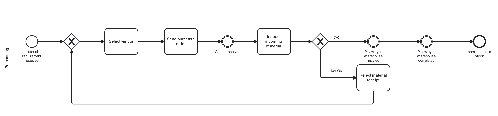

# bpa_lab_docs 
## about the BPA lab
The Business Process Automation Lab (BPA Lab) at the TH Cologne is a small-sized and modular model factory specifically focused on process automation and data-driven process analysis. 

The BPA Lab has two main goals: 

1) Demonstration: Demonstrate concepts and technologies for intelligent process automation. To this end, various hardware and software components such as BPMS, RPA, IoT devices, and Fischertechnik robots will be combined to simulate the production and logistics processes of a bicycle manufacturing company. In addition, technologies such as process mining will be used to demonstrate how business processes can be improved through a data-driven approach. 

2) Teaching: Individual components of the BPA Lab (like the Fischertechnik warehouse robot) will be used in student projects (Bachelor) as building blocks for self-defined process implementations to teach the aspect of process-oriented application integration in a tangible way. 

## about this repository 
This repository contains documentation about the BPA Lab as a Demonstration Factory. The demonstration scenario is an end-to-end bicycle ordering, manufacturing and shipment process.

Please refer to the bpa_lab_student_docs repository (wiki) for documentation on how to use individual  modules of the BPA Lab (e.g. warehouse robot) inside other process implementation projects and refer to bpa_lab_papyrus_uml for raw data of architecture diagrams created in Papyrus.

## about components and its repositories in BpaLabTHCologne organization
In 2023, the first components based on a new architecture were designed. The architecture is still under development, but will cover at least the three levels shown in the simplified overview:
- Controller: control of hardware components (which are: FT learning factory, FT robots, IOT devices)
- Process applications communicating via gRPC to Camunda 8 and via MQQT to controllers
- Process / workflow engine: Camunda 8 (cloud or self-managed) platform executing various processes and decision models of the process applications (currently Camunda 8 Cloud - move to self-managed platform planned)

A modular design following a Domain Driven Design approach is envisaged to enable parallel work on student projects. Therefore, job workers and process models should be splitted by domain (order management, manufacturing, shipping, ...). 

### simplified overview 

### repositories

The current building blocks of the BPA Lab are distributed across several repositories. Besides the repositories for documentation (this one, bpa_lab_student_docs and bpa_lab_papyrus_uml).

### Controller level: 

bpa_lab_txt_warehouse_control: Control component for the Fischertechnik warehouse robot

bpa_lab_ft_factory_control: Control component for the Fischertechnik Learning Factory 

### Communication between Controler and Process Applications level:

bpa_lab_broker: Info on MQQT setup; required for communication of controller and job worker 

### Process application level:

The process applications do include smaller process models for testing. These are not yet integrated with each other to implement the envisaged end-to-end business processe of a bicycle manufacturing company.

bpa_lab_warehouse_robot: Zeebe (Camunda 8) job worker communicated via MQQT with bpa_lab_txt_warehouse_control and via gRPC with Camunda 8 (Cloud). Implementation includes simplified business process, databases etc.

bpa_lab_ft_factory_zeebemqttbridge: Zeebe (Camunda 8) job worker communicated via MQQT with bpa_lab_ft_factory_control

### Workflow Engine: 

The implementation currently uses the Camunda 8 workflow engine (Software as a service plattform). Process models are deployed by the process applications. No customization / extension is foreseen here. 

## about depreciated repositories in BpaLabTHCologne organization

This GitHub organisation contains a number of (in principle) depreciated repositories containing the results of student projects between 2021 and 2023. Some of these do not follow the new (2023) architecture of the BPA Lab solution. However, all these projects contain valuable parts that are (partly) not integrated in the new solution

BPALab_22_Prototype_IOT: Very initial prototype for integrating a Camunda with an IOT device and a Fischertechnik warehouse robot. Based on Camunda 7, no docker. All parts are used in other repositories.

BPALab_GP22_23: Result of the Camunda (and RPA) part of the Guided Project WS 22/23. Contains valuable parts (overall process design for bicycle manufacturing, single page application for order entry connected to Camunda, RPA demonstrator for shipping). It introduces a docker setup. Solution based on Camunda 7 and without MQQT. Results should be considered as a design document or in some cases as building blocks for a new solution.

BPALab_22_Prototype_IOT: Results of Guided Project WS 22/23 for IOT solution with integration to Camunda. It is not integrated with Camunda / RPA deliverable and was (partly) used in the master thesis IoT-aware-BP. It contains the most sophisticated IOT device logic.

IoT-aware-BP: Master thesis at BPA Lab, focusing on how to integrate process and IoT data in terms of architecture, process modelling, etc. Implementation based on Camunda 8! Concepts will be used for future design. Integration of warehouse robots in business process (manufacturing and shipping) to be considered. IOT device setup must be combined with results from BPALab_22_Prototype_IOT (which uses more sophisticated setup).  

## Business process of demonstration factory

The following description depicts the to be business process in the BPA Lab for Demonstration. It is  - work in progress - and requires improvements (harmonization of terms, more details, ...)

The scenario: A bicycle manufacturer offers highly customizable bicycles to consumers 

The entire end-to-end process is managed by the order management process, which initiates purchasing, manufacturing, and shipping processes as needed. 
Purchasing, manufacturing, and shipping use logistics processes.

The following diagrams provide strategic models for each process. The process models do not include technical aspects and only illustrate the happy path.

### order management

This process manages the fulfillment of customer orders.

The process starts when a customer order is entered into a web portal (external web application), which triggers the end-to-end order management process. During the process, the availability of the ordered bike is checked. If a bike with the exact specifications is in stock, the shipping process is initiated. After shipping, an invoice is sent to the customer and the process is complete.

In the standard scenario, the ordered bicycle is not in stock. A production order is created, specifying the required components based on a bill of materials. If any component is missing, the purchasing process is initiated. Otherwise, the manufacturing process is initiated immediately. Once the product is manufactured, shipping is initiated.

### purchasing

This process manages the purchase of required components. The process starts when a component is needed. 

First, a purchase order is created that specifies parameters such as vendor, material, and quantity. The system then sends the purchase order to the vendor. When the goods are received, an incoming inspection is performed. If a quality problem is detected, the materials are rejected and a new purchase order is created. Otherwise, the logistics process (putaway scenario) is triggered.  

The process then marks the material requirement as fulfilled.

### manufacturing

This process manages the manufacturing of a finished good (product). The process is initiated when materials are available.

First, a production planning activity is performed, which creates a production order. This production order is checked by the production planning staff. If the production order is not ok, the production planning has to be repeated. Otherwise, the components are transported to the factory. After that, the first step in the factory, which puts the material into the high-bay warehouse inside the factory, is performed by initiating the FT factory controller. 

Then the production order is released and the actual manufacturing process is executed by once again initiating  the FT Factory Controller.  

The finished goods are then transported to the warehouse (Fishertechnik robot) and put away.

The process ends when the product is stored in the warehouse.

### shipment

This process manages the shipment of finished goods to the customer. The process begins when a product is in stock and ready to be shipped to the customer.

First, a shipment object is created. This shipment is tendered (sent) to a Transportation Service Provider (TSP), which either accepts or rejects the shipment. This status is not entered manually but by an RPA robot (shipment robot). If a shipment is rejected, an alternative TSP is selected. After acceptance, the logistics process (picking scenario) is initiated. After goods issue, the physical transport is performed by the TSP. After the product is delivered to the customer, the TSP sets the order to "Delivered" in its system. This status update is once again transferred by the shipment RPA robot.

### logistics (warehousing)

 process")

This process manages the flow of goods in a warehouse. This is represented by the Fischertechnik warehouse robot.
The process begins when a transfer order for the warehouse is received by another business. This could be an instruction to move products in or out of the  warehouse.

There are two scenarios:
"Put-away (store)": This means a product needs to be stored in a specific storage location.
"Picking (exstore)": This indicates that a product need to be retrieved from a specific storage location.

If the transfer order is for "put-away (store)," the system checks if the specified storage location is actually available in the warehouse to store the products. This check is done by the warehouse staff. If the storage location is available, the process stores the product in the warehouse by calling the warehouse robot control module.  If the storage location is not available, the warehouse staff needs to specify an alternative storage location. After storing the product, the system updates the information about the warehouse's occupancy status in the inventory database.

If the transfer order is for "picking (exstore)," the process involves checking the actual availability by the warehouse staff. If product is available the requested product are picked from the warehouse by calling the warehouse robot control module. After retrieving the product, the system updates the occupancy status of the storage location in the inventory database. 

The process then marks the transfer order as completed, indicating that the requested action (storage or retrieval) has been successfully executed.

## deployment diagram
UML deployment diagram

